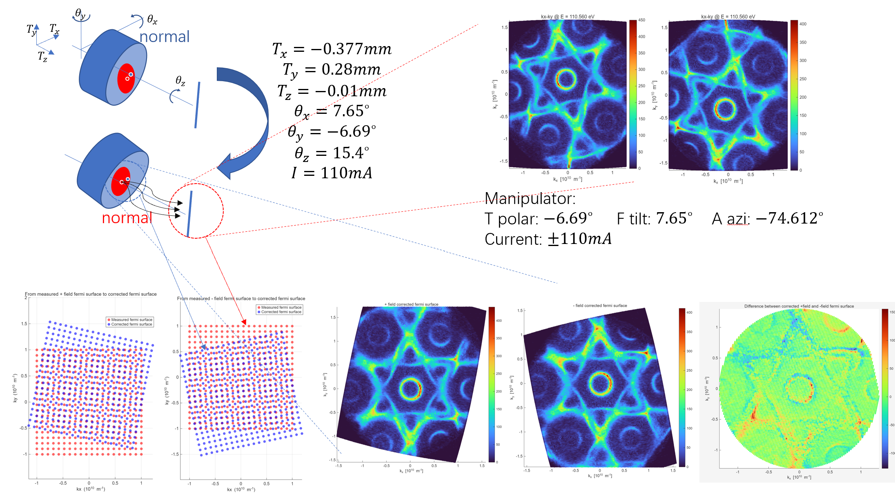
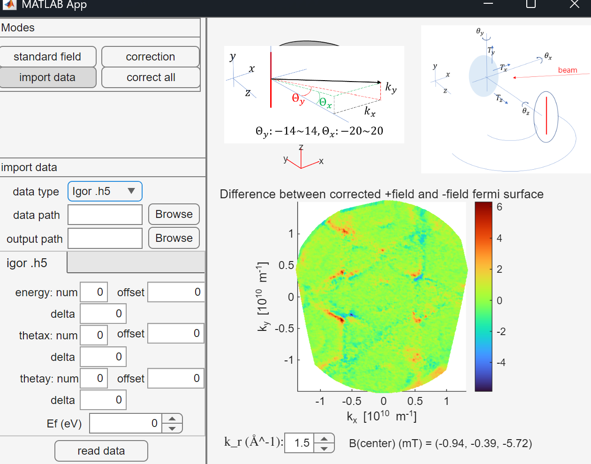

# Python Codes (toy model)
Assuming that the sample be put at $(0,0,0)$， while calculating the field through **elliptic integration**，and integrating the motion of electrons through **Boris pusher algorithms**.

## magnetoarpes.py
This file contains a `MagnetoARPES` class, which integrates all the functions needed during simulation: 
1. calculating the field with translation and rotation of the coil
2. simulating the trajectories of electrons emitted
3. building the inverse mapping from final velocity to initial velocity to irradicate the extrinsic effect of the field.

## examples_of_magnetoarpes.ipynb
This file builds an instance of `MagnetoARPES` and shows how some functions work.

# Matlab Codes
## Workflow1
Find a set of parameters that describes the position of the coil when the sample is tuned normal to the DA in the experiment.

## Workflow2
Get + field and - field bands from experiments, with the sample tuned normal to the DA, which can be realized by looking at 0 field bands.

Preprocess these bands in Igor to correct the fermi-surface... And export the preprocessed data to .h5, which are read by matlab to generate .mat data files.

Based on the logged manipulator angles, tune the parameters until + and - field FS, corrected with this set of parameters, match well. Then we believe that this set of parameters greatly describes the magnetic field in this experiment.

Then, implement correction on 3D data (implement correction on each energy slice) and export the corrected bands into a .bin file.

### App1.mlapp
All steps above can be completed in this GUI app.
Detailed instruction can be seen [here](./instruction.pdf).

Notice: currently The way of measuring similarity is $mean(abs(A_+-A_-))$, but this needs good initial guess. We need to manually put in an initial guess so that the two corrected band already fall on the position.