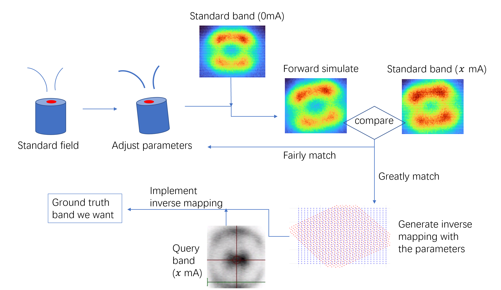

# Python Codes (toy model)
Assuming that the sample be put at $(0,0,0)$， while calculating the field through **elliptic integration**，and integrating the motion of electrons through **Boris pusher algorithms**.

## magnetoarpes.py
This file contains a `MagnetoARPES` class, which integrates all the functions needed during simulation: 
1. calculating the field with translation and rotation of the coil
2. simulating the trajectories of electrons emitted
3. building the inverse mapping from final velocity to initial velocity to irradicate the extrinsic effect of the field.

## examples_of_magnetoarpes.ipynb
This file builds an instance of `MagnetoARPES` and shows how some functions work.

# Matlab Codes
## Workflow

## calc_standard_field.m
Calculate the filed, given the real geometry (coil, core, shield), with no translation or rotation， which means the geometry is normal at the center， and with a current of 0.2A. 

The result is stored as some values on grids. `R=solve(model)` cannot be stored because when you load it next time and interpolate the field value at some points, it will generate incorrect results, different from the `R` directly solved.

The grid data is stroed in `standard_field.mat`

## calc_inverse_mapping.m
Given certain parameters (current of $x$ mA, some translation and rotation), derive the field from standard field. And build an inverse mapping from finally received kx-ky to from initial kx-ky. 

The field interpolant at this parameters and inverse mapping are stored in `inverse_mapping.mat`.

## read_bin
Read the data obtained by ARPES, stored in .bin files.

## tool_forward_mapping.m
For a standard experiment, a material **whose band is not affected** by $\bm{B}$ is used. Fermi surface at $I=0$ mA and $I=x$ mA are measured. 

The Fermi surface at $I=0$ mA is put into this script to get a simulated received band at $I=x$ mA, with the parameters set in `calc_reverse_mapping.m`. 

Then we can adjust the parameters in `calc_reverse_mapping.m` to make the simulated band more similar to the real $I=x$ mA band.

## tool_backward_mapping.m
After optimizing the parameters, we can input to `try_backward_mapping.m` another band obtained by ARPES with $I=x$ mA. It will return the corresponding band that eliminates the extrinsic field distortion. 

## optimized_parameters.m
A function that integrates the following process:
1. Get the magnetic field on grids and build the interpolation with given parameters(translation, rotation and current).
2. Compare the simulated fermi surface pattern with the measured fermi surface pattern. Both describe only the field effect at $I=30mA$. (since fermi surface of standard samples aren't affected by the field )
3. Optimization to obtain the parameters that make the simulation match the best with the measured result.

Therefore, using the parameters obtained to build the field, we can simulate the electrons and get the information of electrons at the surface of the material. For another unknown sample, this will remove the extrinsic effect from field on electrons, uncovering the intrinsic effect of field on material bands.