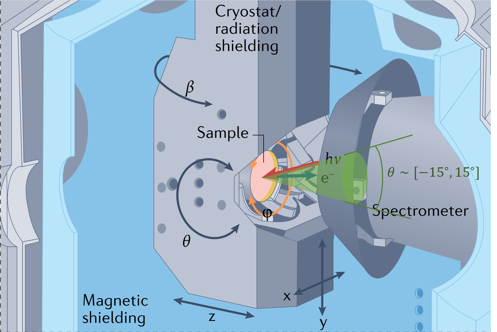

# Python Codes
Different from Matlab parts, it's assumed that the sample be put at $(0,0,0)$， while calculating the field through **elliptic integration**，and integrating the motion of electrons through **Boris pusher algorithms**.

## magnetoarpes.py
This file contains a `MagnetoARPES` class, which integrates all the functions needed during simulation: 
1. calculating the field with translation and rotation of the coil
2. simulating the trajectories of electrons emitted
3. building the inverse mapping from final velocity to initial velocity to irradicate the extrinsic effect of the field.

## examples_of_magnetoarpes.ipynb
This file builds an instance of `MagnetoARPES` and shows how some functions work.

# Matlab Codes
The codes are basically equivalent to python programs.

Different from python parts, matlab codes here calculate the field through Finite Element Method (**FEM**) and integrate the motion of electrons through Ordinary Differential Equation (**ODE**). 

Therefore, the geometry also differs: an air cylinder is set, whose bottom reaches $z=0$, the sample is put at $(0,0,\frac{\text{airHeight}}{2}+\frac{\text{coilHeight}}{2})$.

## calc_field.m
[calc_field.m](./calc_field.m) is a function.
It computes the magnetic field with certain position of he coil, 
assuming the sample is on xy plane, at $ z = \frac{\text{airHeight}}{2}+\frac{\text{coilHeight}}{2}$ 
and the coil is translated and rotated around the point $(0,0,\frac{\text{airHeight}}{2}+\frac{\text{coilHeight}}{2})$.

In the figure above, the outermost cylinder is boundary of the system while the inner cylinder is the coil.

## example_calc_trajectory.m
[example_calc_trajectory.m](./example_calc_trajectory.m) is a script to generate and plot a single trajectory of an emitting electron from the center of the top of the coil, with no translation or rotation.

Anyway, it is <big><big>useless</big></big>...

## backward_calc.m
[backward_calc.m](./backward_calc.m) is a function to calculate the initial velocity of an electron, given its outcoming position and outcoming velocity. 

It generates a virtual electron with $+e$ charge and put it with the opposite speed from the endpoint, and integrate its motion until the virtual electron hits initial xy plane, therefore getting the initial velocity. 

However, although we know the velocity of elctrons entering the lens, we cannot determine the position of electrons entering the lens. Thus this function hasn't been used yet.

As can be seen in this configuration picture of ARPES, electrons enter the lens through a large entrance area.

## calc_faked_initial.m
[calc_faked_inital.m](./calc_faked_initial.m) is a function with many options:
1. The basic aim is to find the trajectory of an emitting electron and velocity at each point on it.
2. Get the faked initial point of an outcoming electron, by extending the final velocity in an opposite direction.
3. See whether the electron enters the slit. However, there is a lens (DA) before the slit, so this option is meaningless.
4. Choose to polt the geometry, trajectory, reversely extended line from the endpoint, and the position of slit.

Anyway, this function is also <big><big>useless</big></big>...

## createv0distr.m
[createv0distr.m](./createv0distr.m) is a function to generate a $(N1,N2,N3,3)$ matrix, which contains $N1*N2*N3$ velocities. 

There are $N3$ energies of electrons, and there are $N1*N2$ in-plane velocities for each energy. 

## many_particle_simulation.m
[many_particle_simulation.m](./many_particle_simulation.m) is a script that finds all the **outcoming velocities** corresponding to initial velocites generated by [createv0distr.m](./createv0distr.m).
You can adjust the translation and rotation of the coil relative to the sample. 

For each geometric setting, it not only simulates to get the outcoming velocities, but also build a `invMapCell`. For example, electrons with different in-plane momentum from $N$ different energy have already been simulated. Then there are $N$ slices in invMapCell, each of which gives a 2D interpolation so that one can get initial $(vx0, vy0)$ from outcoming $(vx, vy)$. 

## getInitialVelocity.m
[getInitialVelocity.m](./getInitialVelocity.m) is a function to obtain initial $(vx0, vy0)$ from outcoming $(vx, vy)$, given certain $E$ (or $|v|$). 

First, it finds the slice in `invMapCell` with the closest $|v|$. 
And then it gets the initial $(vx0, vy0)$ through interpolation from simulated results.